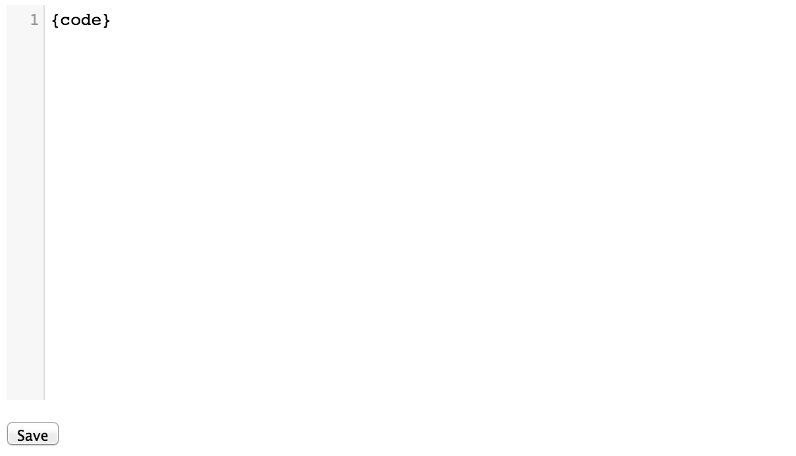
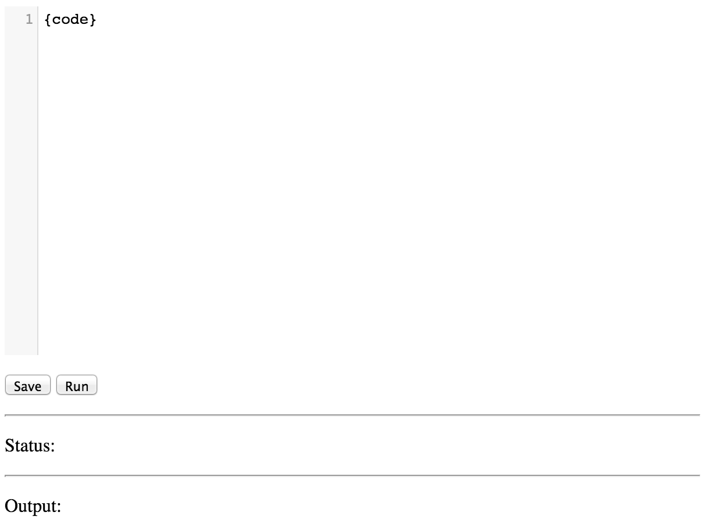
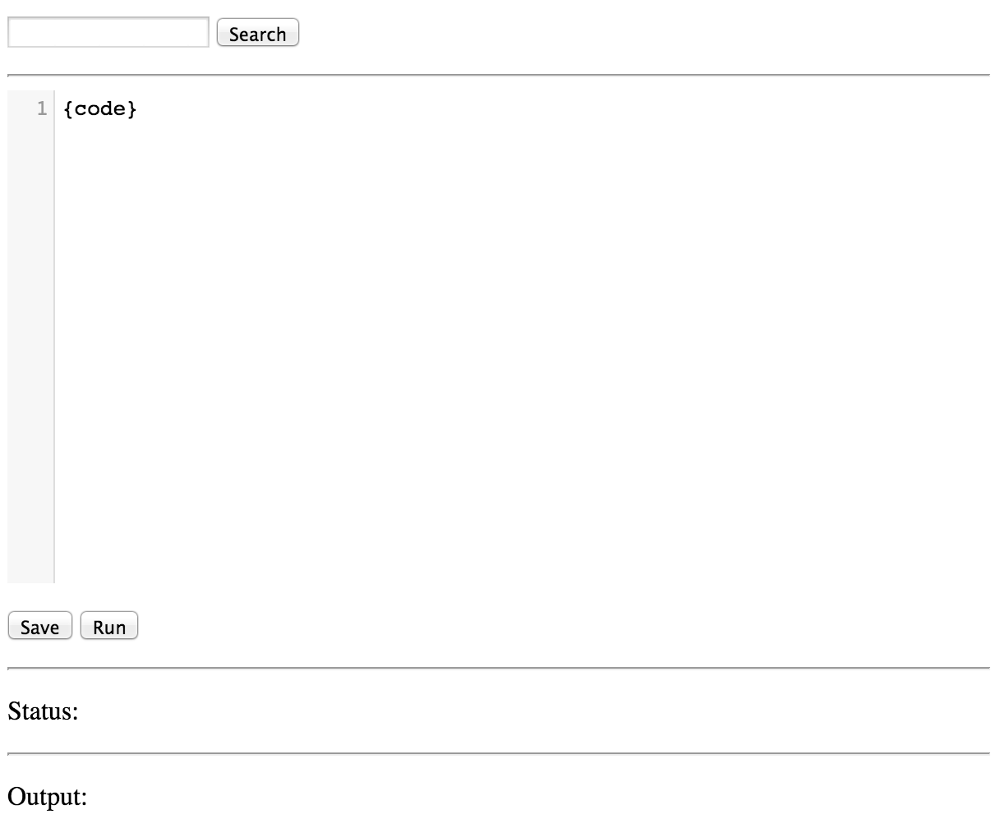

.. _zerocloud-snakebin:

Example Application Tutorial: Snakebin
======================================

Snakebin is a combination of `Pastebin <http://pastebin.com>`_
and `JSFiddle <http://jsfiddle.net/>`_, for Python. It allows a user to create
and store Python scripts in ZeroCloud, retrieve them using a unique URL, and
execute them through a web interface. Essentially this is a copy of the
`Go Playground <http://play.golang.org>`_, but for Python.

In this tutorial, we will be building the entire application from scratch and
deploying it to ZeroCloud. The result will be a web application, complete with
a REST API and a basic UI written in HTML and JavaScript. The entire backend
for the REST API will be implemented in Python.

Overview
--------

- :ref:`Part 1: Upload/Download Scripts <snakebin_part1>`
- :ref:`Part 2: Execute Scripts <snakebin_part2>`
- :ref:`Part 3: Search Scripts <snakebin_part3>`

We will build the application in three parts. In the
:ref:`first part <snakebin_part1>`, we will implement a REST API for uploading
and downloading Python scripts to/from ZeroCloud. We will also implment a basic
UI to interact with the REST interface in HTML and JavaScript.

In the :ref:`second part <snakebin_part2>`, we will add a "Run" button to the
UI to remotely execute scripts on ZeroCloud. The secure isolation of ZeroVM
will ensure that any arbitrary code can run safely.

In the :ref:`third and final part <snakebin_part3>`, we will implement a
parallelized MapReduce-style search function for searching all existing
documents in Snakebin. The search function will be driven by a REST endpoint
and will include a "Search" field in the UI.

Setup
-----

The first thing you'll need to do is set up a
:ref:`development environment <devenv>`, including the ``python-swiftclient``
and ``zpm`` command line tools.

Next, you should create a working directory on your local machine. In this
tutorial, we will put all project files in a directory called ``snakebin``
inside the home directory. Change to this directory as well.

.. code-block:: bash

    $ mkdir $HOME/snakebin
    $ cd $HOME/snakebin

Swift Container Setup
---------------------

To deploy and run the application, we'll need three containers:

* ``snakebin-api``: This will serve as the base URL for REST API requests. This
  container will only contain the HTML / JavaScript UI files.
* ``snakebin-app``: This will contain all of the application files, except for
  the UI files.
* ``snakebin-store``: This will serve as our document storage location. No
  direct access will be allowed; all documents must be accessed through the
  REST API.

Go ahead and create these containers now. You can do this using the ``swift``
command line tool:

.. code-block:: bash

    $ swift post snakebin-api
    $ swift post snakebin-app
    $ swift post snakebin-store

Double-check that the containers were created:

.. code-block:: bash

    $ swift list
    snakebin-api
    snakebin-app
    snakebin-store

Add ``zapp.yaml``
-----------------

The next thing we need to do is add the basic configuration file which defines
a ZeroVM application (or "zapp"). ``zpm`` can do this for us:

.. code-block:: bash

    $ zpm new

This will create a ``zapp.yaml`` file in the current directory.

Open ``zapp.yaml`` in your favorite text editor.

Change the ``execution`` section

.. code-block:: yaml

    execution:
      groups:
        - name: ""
          path: file://python2.7:python
          args: ""
          devices:
          - name: python2.7
          - name: stdout

to look like this:

.. code-block:: yaml

    execution:
      groups:
        - name: ""
          path: file://python2.7:python
          args: ""
          devices:
          - name: python2.7
          - name: stdout
            content_type: message/http
          - name: stdin
          - name: input
            path: swift://~/snakebin-store

Change the ``help`` section

.. code-block:: yaml

    help:
      description: ""
      args:
      - ["", ""]

to look like this:

.. code-block:: yaml

    help:
      description: ""
      args: []

Edit the ``bundling`` section

.. code-block:: yaml

    bundling: []

to include the source files for our application (which we will be creating
below):

.. code-block:: yaml

    bundling: ["snakebin.py", "save_file.py", "get_file.py", "index.html"]

The final result should look like this:

.. literalinclude:: zapp.yaml
   :language: yaml

.. _snakebin_part1:

Part 1: Upload/Download Scripts
-------------------------------

First, we need to build an application for uploading and retrieving scripts,
complete with a basic HTML user interface.

Before we dig into the application code, we need to design our API.

.. _snakebin_ul_dl_api:

REST API
++++++++

For the time being, we only need to support a few different types of requests:

``GET /snakebin-api``:
    Get an empty HTML form for uploading a script.

``POST /snakebin-api``:
    Post file contents, get a ``/snakebin-api/:script`` URL back.

``GET /snakebin-api/:script``:
    Retrieve uploaded file contents.

    If a request specifies the header ``Accept: text/html`` (as is the case
    with a web browser), load the HTML UI page with the script textarea
    populated. For any other ``Accept`` value, just return the raw script
    contents.

The Code
++++++++

ZeroCloud provides a CGI-like environment for handling HTTP requests. A lot of
what follows involves setting and reading environment variables and generating
HTTP responses from scratch.

http_resp
.........

Since generating HTTP responses is the most crucial part of this application,
let's first define utility function for creating these responses. In your
``snakebin`` working directory, create a file called ``snakebin.py``. Then add
the following code to it:

.. literalinclude:: snakebin_part1.py
   :pyobject: http_resp
   :emphasize-lines: 19

For this we'll need to import ``sys`` from the standard library. Add an
``import`` statement to the top of the file:

.. code-block:: python

    import sys

Notice the last line, which is highlighted: ``sys.stdout.write(resp)``.

The ZeroCloud execution environment handles most communication between parts of
an application through ``/dev/stdout``, by convention. To your application code
(which is running inside the ZeroVM virtual execution environment),
``/dev/stdout`` looks just like the character device you would expect in a
Linux-like execution environment, but to ZeroCloud, you can write to this
device to communicate to a client or start a new "`job`", all using HTTP. (In
this tutorial, we'll be doing both.)

Job
...

A "`job`" is defined by a collection of JSON objects which specify commands
to execute, environment variables to set (for the execution environment),
and device mappings. ZeroCloud consumes job descriptions to start new
jobs, which can consist of one or more program execution groups. For the
moment, we'll only be dealing with single program jobs. (In
:ref:`part three <snakebin_part3>`, we'll need to define some multi-group
jobs to implement the MapReduce search function. But don't worry about that
for now.)

Let's create a class which will help us generate these jobs. Add the following
code to ``snakebin.py``. For simplicity, some Swift object/container names are
hard-coded.

.. literalinclude:: snakebin_part1.py
   :pyobject: Job

This class makes use of the ``json`` module, so lets add an import statement
to the top of the file:

.. code-block:: python

    import json

GET and POST handling
.....................

Now we're getting into the core functionality of our application. It's time to
add code to handle the ``POST`` and ``GET`` requests in the manner that we've
defined in our :ref:`API definition <snakebin_ul_dl_api>` above.

We'll need to add 4 new blocks of code:

- a function to handle ``POST`` requests
- a function to handle ``GET`` requests
- a utility function to check for file duplicates
- a "main" block to start the program and call the right handler function

.. literalinclude:: snakebin_part1.py
   :lines: 69-

This codes makes use of more standard library modules, so we need to add import
statements for those:

.. code-block:: python

    import base64
    import hashlib
    import os
    import random
    import sqlite3
    import string
    import urlparse

Your ``snakebin.py`` file should now look something like this:

.. literalinclude:: snakebin_part1.py

``get_file.py`` and ``save_file.py``
....................................

In ``snakebin.py``, there are some references to additional source files to
handle saving and retrieval of uploaded documents. Let's create those now.

``get_file.py``:

.. literalinclude:: get_file_part1.py

``save_file.py``:

.. literalinclude:: save_file_part1.py

User Interface
..............

To complete the first evolution of the Snakebin application, let's create a
user interface. Create a file called ``index.html`` and add the following code
to it:

.. literalinclude:: index_part1.html
   :language: html

Bundle and deploy
+++++++++++++++++

Bundle:

.. code-block:: bash

    $ zpm bundle
    created snakebin.zapp

Deploy:

.. code-block:: bash

    $ zpm deploy snakebin-app snakebin.zapp
    app deployed to http://127.0.0.1:8080/v1/AUTH_123def/snakebin-app/

Setting environment variable for the storage token with this value will make
commands more concise and convenient to execute:

.. code-block:: bash

    $ export OS_STORAGE_ACCOUNT=AUTH_123def...

Configure the endpoint handler zapp for ``snakebin-api``, ``snakebin-app``, and
``snakebin-store``:

.. code-block:: bash

    $ swift post --header "X-Container-Meta-Rest-Endpoint: swift://$OS_STORAGE_ACCOUNT/snakebin-app/snakebin.zapp" snakebin-api
    $ swift post --header "X-Container-Meta-Rest-Endpoint: swift://$OS_STORAGE_ACCOUNT/snakebin-app/snakebin.zapp" snakebin-app
    $ swift post --header "X-Container-Meta-Rest-Endpoint: swift://$OS_STORAGE_ACCOUNT/snakebin-app/snakebin.zapp" snakebin-store

We'll also need to set execution permissions for unauthenticated (anonymous)
users on the same three containers:

.. code-block:: bash

    $ swift post --header "X-Container-Meta-Zerovm-Suid: .r:*,.rlistings" snakebin-api
    $ swift post --header "X-Container-Meta-Zerovm-Suid: .r:*,.rlistings" snakebin-app
    $ swift post --header "X-Container-Meta-Zerovm-Suid: .r:*,.rlistings" snakebin-store

Test
++++

Now that the first working part of our application is deployed, let's test
uploading and retrieving some text.

First, create a file called ``example.py``, and add any text to it. For
example:

.. code-block:: python

    print "hello world!"

Now upload it:

.. code-block:: bash

    $ curl -X POST -H "X-Zerovm-Execute: api/1.0" $OS_STORAGE_URL/snakebin-api --data-binary @example.py
    http://127.0.0.1:8080/api/$OS_STORAGE_ACCOUNT/snakebin-api/GDHh7vR3Zb

The URL returned from the ``POST`` can be used to retrieve the document:

.. code-block:: bash

    $ curl http://127.0.0.1:8080/api/$OS_STORAGE_ACCOUNT/snakebin-api/GDHh7vR3Zb
    print "hello world!"

.. note:: Note that in the ``POST`` we have to supply the
    ``X-Zerovm-Execute: api/1.0`` header because this tells ZeroCloud how to
    interpret the request. Alternatively, you can change the ``/v1/`` part of
    the URL to ``/api/`` to make requests simpler, and also to accomodate
    simpler ``GET`` requests, using ``curl`` (as is shown above) or a web
    browser.

We can also try this through the web interface. Open a web browser and go to
``http://127.0.0.1:8080/api/$OS_STORAGE_ACCOUNT/snakebin-api``. You should get a
page that looks something like this:

Type some text into the box and play around with saving documents. You can also
try to browse the the document we created above on the command line
(``http://127.0.0.1:8080/api/$OS_STORAGE_ACCOUNT/snakebin-api/GDHh7vR3Zb``).

.. _snakebin_part2:

Part 2: Execute Scripts
-----------------------

In this part, we'll add on to what we've built so far and allow Python scripts
to be executed by Snakebin.

API updates
+++++++++++

To support script execution via HTTP (either from the command line or browser),
we will need to add a couple more endpoints to our API:

``GET /snakebin-api/:script/execute``:
    Execute the specified ``:script`` and return the output as text.
    The script must already exist and be available at
    ``/snakebin-api/:script``.

``POST /snakebin-api/execute``:
    Execute the contents of the request as a Python script and return the
    output as text.

The following changes will implement these two endpoints.

The Code
++++++++

First, let's update the ``post()`` handler function:

.. literalinclude:: snakebin_part2.py
   :pyobject: post
   :emphasize-lines: 7-11,13-45

Then update the ``get()`` handler function to allow ``/execute`` to specified
on the end of a document URL (to execute the document instead of retrieving it:

.. literalinclude:: snakebin_part2.py
   :pyobject: get
   :emphasize-lines: 4-26

The important change here is the parsing of the ``execute`` from the request
URL and the setting of the ``SNAKEBIN_EXECUTE`` environment variable, which
will be read by ``get_file.py``.

``get()`` needs the ``re`` (regular expressions) module from the standard
library. Add an import statement for that to the top of ``snakebin.py``:

.. code-block:: python

    import re

Next, add a new function to ``snakebin.py`` called ``execute_code``. This
will be used for executing the arbitrary code that users submit through
Snakebin.

.. literalinclude:: snakebin_part2.py
   :pyobject: execute_code

This new function requires the ``StringIO`` and ``imp`` modules from the
standard library, so add some import statements for both of those to the top of
``snakebin.py``:

.. code-block:: python

    import imp
    import StringIO

``snakebin.py`` should now look like this:

.. literalinclude:: snakebin_part2.py
   :language: python

Next, we need to make some modifications to ``get_file.py`` to allow execution
of a script. We need to read the ``SNAKEBIN_EXECUTE`` environment variable
and execute a script if it is present. Update ``get_file.py`` to this:

.. literalinclude:: get_file_part2.py
   :emphasize-lines: 12,15-25,29-32

We now need to update the UI with a "Run" button to hook in the execution
functionality. Update your ``index.html`` to look like this:

.. literalinclude:: index_part2.html
   :language: html
   :emphasize-lines: 42-68,77,80-85

Redeploy the application
++++++++++++++++++++++++

First, rebundle your application files:

.. code-block:: bash

    $ zpm bundle

To redeploy, we'll use the same ``zpm`` command as before, but we'll need to
specify the ``--force`` flag, since we're deploying to an un-empty container:

.. code-block:: bash

    $ zpm deploy snakebin-app snakebin.zapp --force

Test
++++

First, let's try executing one of the scripts we already uploaded. This can be
done simply by ``curl``ing the URL of the script and appending ``/execute``:

.. code-block:: bash

    $ curl http://127.0.0.1:8080/api/$OS_STORAGE_ACCOUNT/snakebin-api/GDHh7vR3Zb/execute
    hello world!

Next, let's trying posting the ``example.py`` script directly to the
``/snakebin-api/execute`` endpoint:

.. code-block:: bash

    $ curl -X POST http://127.0.0.1:8080/api/$OS_STORAGE_ACCOUNT/snakebin-api/execute --data-binary @example.py
    hello world!

Let's also test the functionality in the web browser. If you nagivate to
``http://127.0.0.1:8080/api/$OS_STORAGE_ACCOUNT/snakebin-api``, the new page
should look something like this:

Try writing some code into the text box and click ``Run`` to execute them.

Try also accessing the ``/snakebin-api/:script/execute`` endpoint directly
in the browser using the same the URL in the POST example above:

``http://127.0.0.1:8080/api/$OS_STORAGE_ACCOUNT/snakebin-api/GDHh7vR3Zb/execute``

.. _snakebin_part3:

Part 3: Search Scripts
----------------------

The final piece of Snakebing is a simple search search, which will retrieve
document whose contents contain a given search term. All documents in
``snakebin-store`` will be search in a parallelized fashion.

API updates
+++++++++++

The final endpoint we'll add to our API is ``search``:

``GET /snakebin-api/search?q=:term``:
    Return a JSON list of URLs to the documents (in ``snakebin-store``)
    which contain ``:term``. When this endpoint is hit, a MapReduce job of
    multiple nodes will be spawned to perform the search.

The Code
++++++++

For the MapReduce job, we need to add two new Python modules.

``search_mapper.py``

.. literalinclude:: search_mapper.py

``search_reducer.py``

.. literalinclude:: search_reducer.py

These two files will perform the search operation. Now we need to modify the
``get`` function in ``snakebin.py`` to support the new endpoint:

.. literalinclude:: snakebin_part3.py
   :pyobject: get
   :emphasize-lines: 3-49

This updated version of ``get`` requires ``urllib`` for unquoting search
strings. We'll need to import it:

.. code-block:: python

    import urllib

Now for the final changes to the user interface:

.. literalinclude:: index_part3.html
   :language: html
   :emphasize-lines: 69-92,97-102

We also need to update the ``zapp.yaml`` to include the new Python files.
Update the bundling section:

.. code-block:: yaml

    bundling: ["snakebin.py", "save_file.py", "get_file.py", "index.html",
               "search_mapper.py", "search_reducer.py"]

Redeploy the application
++++++++++++++++++++++++

Just as we did before in :ref:`part 2 <snakebin_part2>`, we need to redeploy
the application, using ``zpm``:

.. code-block:: bash

    $ zpm bundle
    $ zpm deploy snakebin-app snakebin.zapp --force

Test
++++

First, let's try executing the search on the command line. (You should post
a couple of a scripts to Snakebin first, otherwise your search won't return
anything, obviously.)

.. code-block:: bash

    $ curl http://127.0.0.1:8080/api/$OS_STORAGE_ACCOUNT/snakebin-api/search?q=foo
    ["http://127.0.0.1:8080/api/$OS_STORAGE_ACCOUNT/snakebin-api/IOFW0Z8UYR", "http://127.0.0.1:8080/api/$OS_STORAGE_ACCOUNT/snakebin-api/e2X0hNA9ld"]

Let's also test the functionality in the web browser. If you navigate to
``http://127.0.0.1:8080/api/$OS_STORAGE_ACCOUNT/snakebin-api``, the new page
should look something like this:

``http://127.0.0.1:8080/api/$OS_STORAGE_ACCOUNT/snakebin-api``, the new page
should look something like this:

Try typing in a search term and clicking "Search".

Try also accessing the ``/snakebin-api/search?q=:term`` endpoint directly in
the browser.
